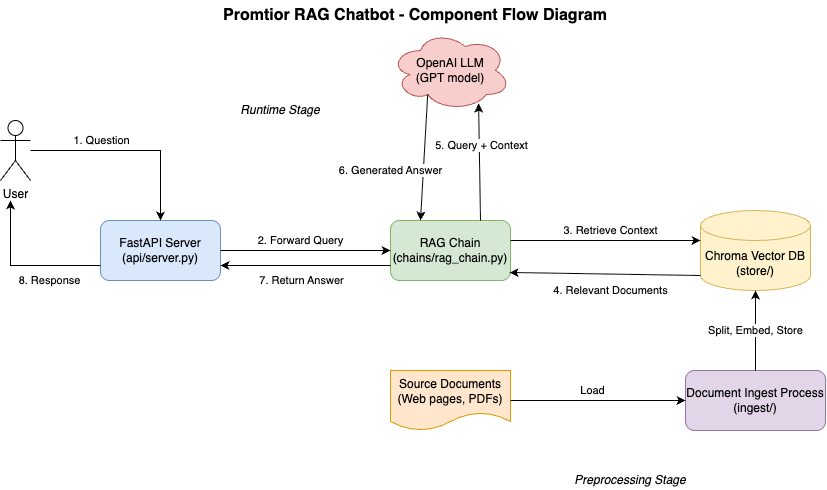

# Project Overview

I developed a Retrieval-Augmented Generation (RAG) chatbot for Promtior that answers questions using the company’s website and PDF documentation.

## Architecture & Components

- **LangServe runtime**: recommended by the Promtior team.
- **Offline ingestion (`ingestion/` folder)**  
  - Runs before app startup—parses website pages and PDF files  
  - Splits text into 750-token chunks with 100-token overlap  
  - Generates embeddings (OpenAI text-embedding-3-small) and loads into ChromaDB  
  - _(Future)_ Schedule as a cronjob to refresh content automatically  
- **Retrieval**  
  - Converts user query to embedding → retrieves top 4 chunks from ChromaDB  
- **Generation**  
  - Feeds retrieved chunks + a strict prompt template to OpenAI LLM  
  - Forces use of provided context only 
- **API Layer**  
  - Exposes `/chat` via FastAPI for easy frontend integration  

## Main Challenges & Solutions

- **Response accuracy**  
  - *Challenge*: preventing hallucinations and ensuring factual answers  
  - *Solution*: designed a prompt template that instructs the LLM to only use provided context and cite sources  

- **AWS deployment**  
  - *Challenge*: initial ECS container mounting and configuration issues  
  - *Solution*: switched to AWS App Runner for a simpler deployment model

- **System extensibility**  
  - *Challenge*: building a flexible architecture that can grow with new data sources  
  - *Solution*: modularized ingestion, processing, embedding and retrieval into independent components  

- **Embedding model**
  - *Challenge*: the app was giving unexpected results, and I was not able to find the reason why.
  - *Solution*: I found out that I was not using the same embedding model for both the ingestion and the retrieval. I configured it globally in the `config.py` file to use the `text-embedding-3-small` model.

- **Duplicate chunks**
  - *Challenge*: the app was not retrieving the correct chunks.
  - *Solution*: I found out that when I ran the ingestion script, it was not deleting the old vector store, so the new chunks were not being added to the vector store. I added a step to delete the old vector store in the ingestion script.

## Future Work

- Move secrets into **AWS Secrets Manager** instead of embedding them in the container image  
- Automate the ingestion pipeline with a scheduled **cronjob** to keep ChromaDB content up to date  
- Fix the issue with chat history caused by the current implementation of the LangServe runtime
- Try different models, for the moment I'm just using the cheapest ones.

## Diagram

